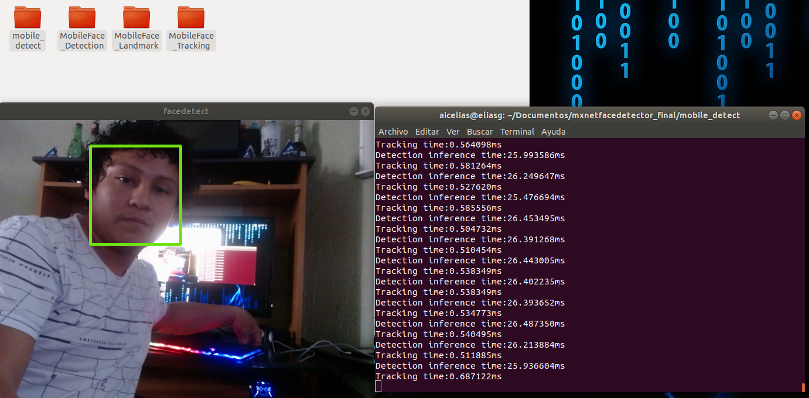

## Mxnet Face Detection

This repository contains a Mxnet implementation for face detection using the mobileface model using a Gpu.
### Download pretrained models in the corresponding folders:
download (mobile_detect) https://drive.google.com/file/d/10ePhV_s60KLKUhHD_AaoeYdTXgTIllC_/view?usp=sharing

download(MobileFace_Detection) https://drive.google.com/drive/folders/18O6P9i2UveQsQqMbs9gsZPI4C7vXQ0CE?usp=sharing

download(MobileFace_Landmark) https://drive.google.com/drive/folders/10KJ5vQFVkAVB0OmaHynDcaXxCqLEjj8D?usp=sharing

download(MobileFace_Tracking) https://drive.google.com/drive/folders/1tlNa9veC9-EMx0wn7FWWdLkHP2g6r1qT?usp=sharing

### To run the project:
cd mobile_detect/python3 livefacemxnet.py

Further optimization is possible as the base MobileFace models have a performance of 200-300 fps.

In the image I show the structure of the folders.

